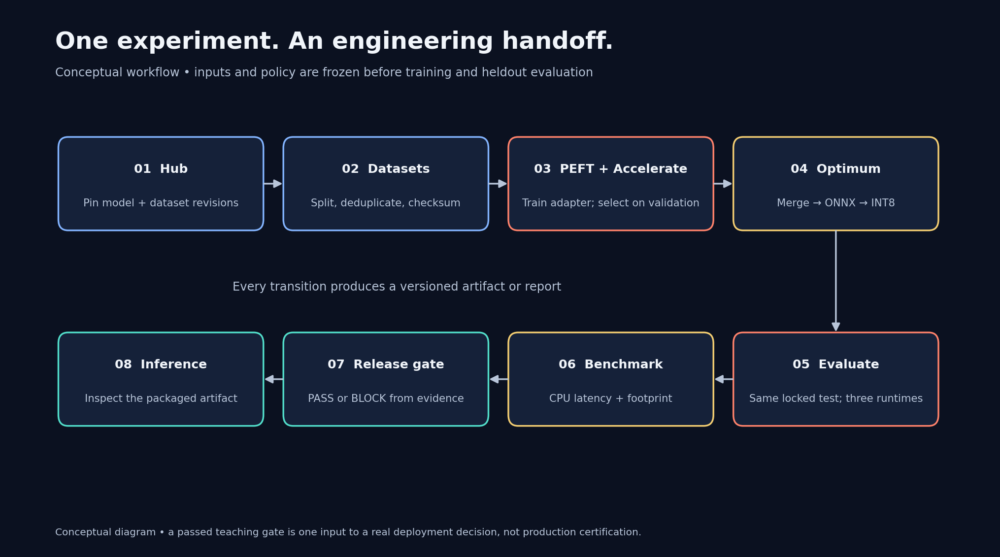
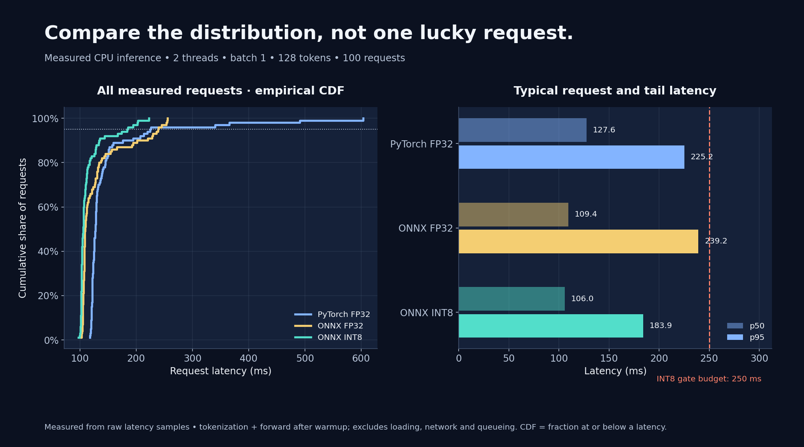

# Bringing the Heat: Supercharging Your ML Pipelines with HuggingFace

**[Muntaser Syed](https://muntasersyed.com) · Florida Institute of Technology**

Presented at **Miami Dade College**.

Take a model from the Hugging Face Hub through fine-tuning, evaluation, optimization, and inference. This repository contains the slides, a complete Colab exercise, diagrams, and measured results from the talk. Students can follow the workflow step by step; ML engineers can inspect the code, measurement protocol, and release checks.

**[View the slides](https://drive.google.com/file/d/1cWJ_CbI899vkuPVZTnfYJgcGdz8jv3t7/view)** · **[Download all materials](https://github.com/jemsbhai/bringing-the-heat/releases/download/v1.0.0/Bringing-the-Heat-kit.zip)**

## What you'll build

The exercise trains a news classifier to recognize **World, Sports, Business, and Sci/Tech**. Follow one model through the pipeline:

**Hub + Datasets → Transformers → PEFT LoRA + Accelerate → Optimum ONNX INT8 → evaluation → release gate → inference**

Along the way, you'll learn to:

- Pin model and dataset revisions and keep training, validation, and test data separate.
- Fine-tune a small subset of parameters with PEFT and run the training loop with Accelerate.
- Export and quantize with Optimum, then evaluate the actual exported model.
- Compare quality, per-class recall, latency distributions, and model size.
- Use an executable release policy to catch regressions before deployment.

## Run the notebook

1. **Open the Colab notebook** using the badge above. Save a copy to your Google Drive if you want to keep your edits and outputs.
2. Select **Runtime → Change runtime type → T4 GPU**, if available, then choose **Runtime → Run all**. CPU execution is supported but full training takes longer.
3. Follow the plots as the notebook trains, exports, evaluates, and benchmarks the model. Inspect the real release decision and the deliberately failing example.
4. Try your own headlines in section 8. Download the generated results ZIP from Colab's **Files** sidebar before the runtime expires.

No Hugging Face token, Drive mount, or paid API is required. The notebook includes its source and installs its dependencies. A complete run on a fresh Colab T4 took **about 16 minutes**, with all 11 code cells and ten figures completing successfully. Runtime availability and timing vary.

To explore without running anything, open the [executed notebook](demo/Bringing_the_Heat_Colab_executed.ipynb) or the [hosted Colab with saved outputs](https://colab.research.google.com/drive/1Q9WkLenTKLEd-R0wTzsCgF1mrLS1NCIh). For local setup and commands, see the [demo README](demo/README.md).

## Explore the materials

| Resource | What you'll find |
|---|---|
| [Slides on Google Drive](https://drive.google.com/file/d/1cWJ_CbI899vkuPVZTnfYJgcGdz8jv3t7/view) | Process diagrams, training curves, measured comparisons, and deployment choices |
| [PowerPoint](output/Bringing-the-Heat.pptx) / [offline slides](output/slides-offline.html) | Downloadable versions of the deck |
| [Attendee handout](output/attendee-handout.md) | Tool map, exercises, and further reading |
| [Figure gallery](assets/colab-figures/README.md) | All ten notebook figures as PNG and SVG |
| [Measured results](output/measured-results.md) / [Colab validation](demo/COLAB_TESTED.md) | Results, hardware details, and benchmark conditions |
| [Questions and answers](output/qa-guide.md) | Explanations of common fine-tuning and deployment questions |
| [Deployment extensions](output/deployment-notes.md) | Paths to browser, ARM, multi-GPU, and managed serving |
| [Muntaser's Hugging Face profile](https://huggingface.co/Jemsbhai) | The public MultiSpecQR models and datasets featured in the talk |

## Read the results

The notebook generates its charts from each run's actual reports. The figure gallery preserves a completed Colab run; the deck's charts show a separate laptop run. Compare results within the same hardware and measurement protocol. Full reports and raw latency samples are available in [demo/results](demo/results/).

A **BLOCK** result is useful evidence: inspect the failed check and its underlying examples. The supplied thresholds illustrate a release policy; set requirements for your own application before evaluating it. Small quality differences on this test set do not establish a general improvement.

## Try it yourself

- Change the inference headlines and inspect where the classifier makes mistakes.
- Compare overall accuracy with each class's recall and confusion-matrix row.
- Compare PyTorch FP32, ONNX FP32, and ONNX INT8 on quality, latency, and weight size.
- Adapt the workflow to another dataset using the [handout's exercises](output/attendee-handout.md). Establish new data splits and acceptance criteria before training.

The complete runnable example uses DistilBERT and AG News. Browser, ARM64, multi-GPU, QLoRA, and managed Endpoints are extension recipes, with their validation scope recorded in the materials. MultiSpecQR is a separate computer-vision project with its own model architecture.

The repository and materials ZIP include source, slides, notebooks, figures, and recorded results. Running the notebook downloads the public inputs and regenerates model artifacts. Its final results bundle also includes the trained INT8 model, tokenizer, adapter, and reports.
