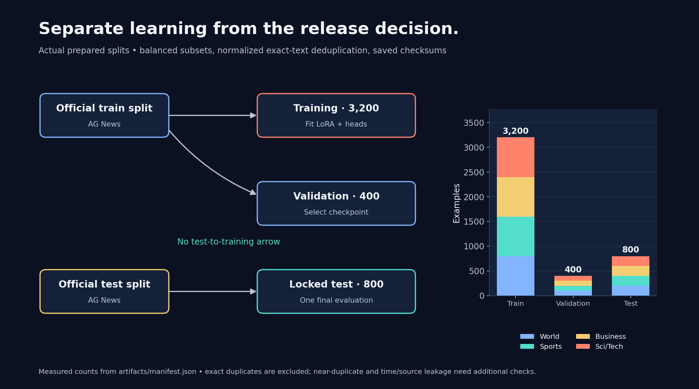
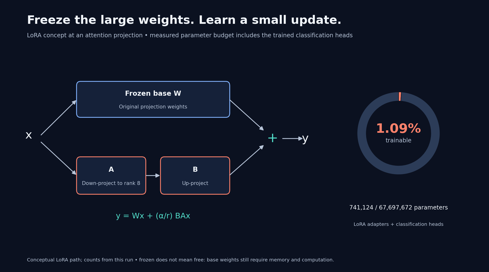
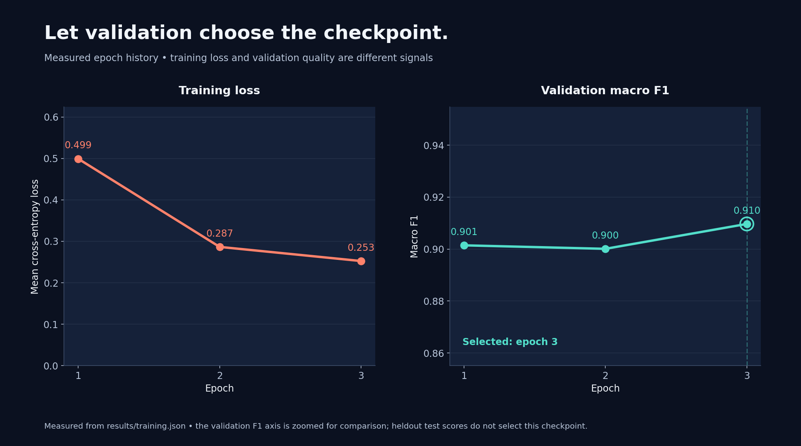
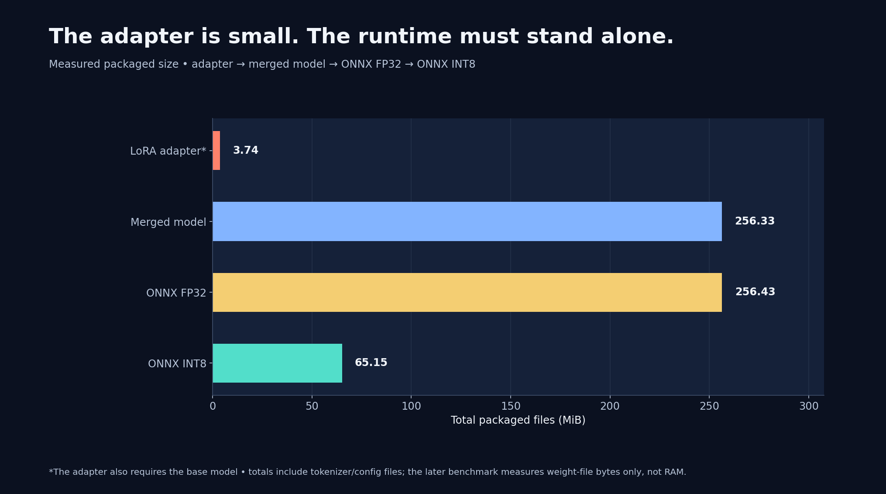
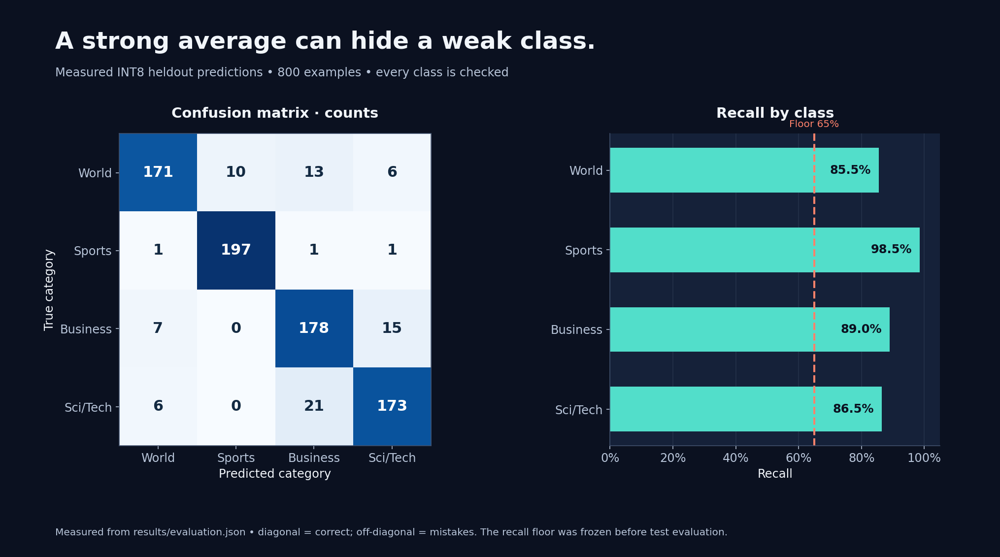
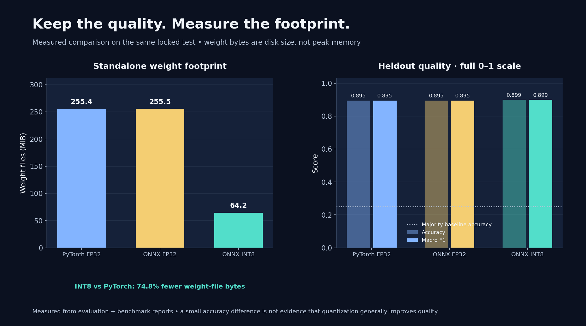
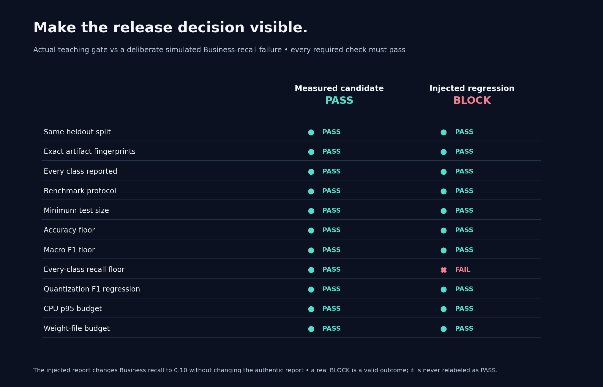
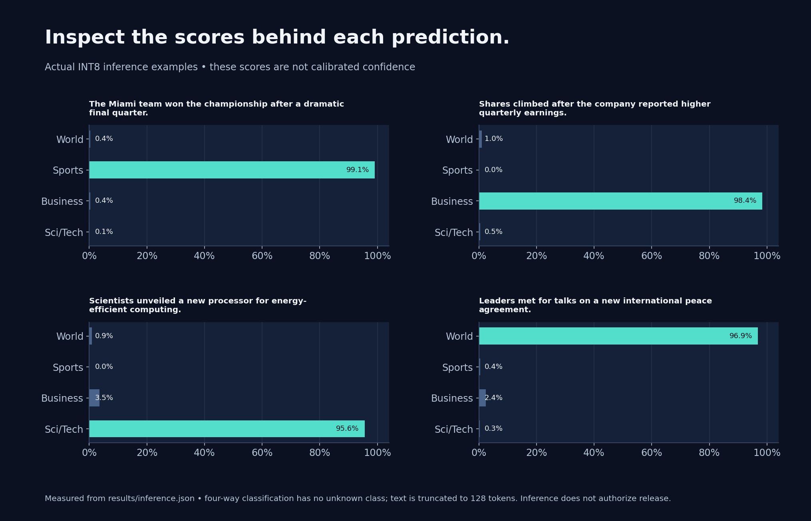

# Colab visual walkthrough

These images were generated in the completed Colab run `20260917-181550-581335`. The workflow and LoRA paths explain the process; numerical plots use that run’s actual reports. The deck’s charts use the separate laptop rehearsal. Hardware, policy and report details are in [the Colab validation record](../../demo/COLAB_TESTED.md).

Every figure is available as PNG and SVG. The notebook regenerates these figures from each new run.

## Workflow

[PNG](01_workflow.png) · [SVG](01_workflow.svg)

## Data splits

[PNG](02_splits.png) · [SVG](02_splits.svg)

## LoRA and trainable parameters

[PNG](03_lora_budget.png) · [SVG](03_lora_budget.svg)

## Training progress

[PNG](04_training_progress.png) · [SVG](04_training_progress.svg)

## Export footprint

[PNG](05_export_footprint.png) · [SVG](05_export_footprint.svg)

## Confusion matrix and class recall

[PNG](06_evaluation.png) · [SVG](06_evaluation.svg)

## Latency distribution and percentiles

[PNG](07_latency.png) · [SVG](07_latency.svg)

## Quality and weight size

[PNG](08_quality_size.png) · [SVG](08_quality_size.svg)

## Release gate

[PNG](09_release_gate.png) · [SVG](09_release_gate.svg)

## Inference scores

[PNG](10_inference.png) · [SVG](10_inference.svg)

